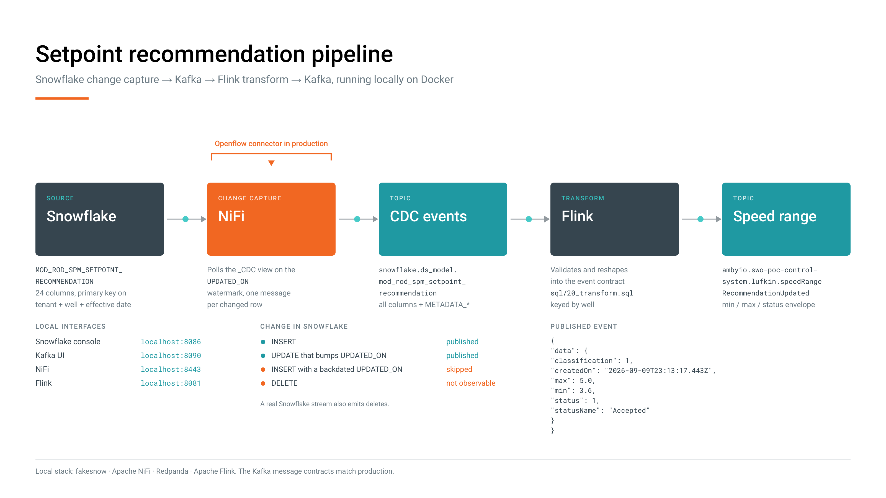

# snowflake-kafka-flink-poc

A complete Snowflake → Kafka → Flink pipeline that runs entirely on your laptop.
Insert a row into Snowflake, and a transformed event lands on a Kafka topic a
few seconds later.

```
Snowflake            NiFi                Kafka                Flink              Kafka
─────────            ────                ─────                ─────              ─────
MOD_ROD_SPM_    ──▶  CDC flow      ──▶   snowflake.ds_    ──▶ transform    ──▶   ambyio.swo-poc-
SETPOINT_             (polls the          model.mod_rod_       + validate         control-system.
RECOMMENDATION        _CDC view)          spm_setpoint_                           lufkin.speedRange
                                          recommendation                          RecommendationUpdated
```

Everything is containerised — no Snowflake account, no cloud resources, no
credentials to obtain.



An animated version is in [`docs/`](docs/README.md) — open `docs/pipeline.html`
in a browser to present it.

## What is real and what is simulated

| Piece | Locally | In production |
| --- | --- | --- |
| Snowflake | [fakesnow](https://github.com/tekumara/fakesnow) — the Snowflake wire protocol on DuckDB | Snowflake |
| Snowflake → Kafka | Apache NiFi flow built by this repo | [Openflow Connector for Snowflake to Kafka](https://docs.snowflake.com/en/user-guide/data-integration/openflow/connectors/snowflake-to-kafka/setup) |
| Kafka | Redpanda (Kafka API compatible) | your Kafka / MSK / Confluent |
| Flink | Apache Flink 2.2, unchanged | Apache Flink |

The **Kafka message contracts are identical either way**, so consumers written
against this stack work unchanged in production. What differs is how changes are
captured out of Snowflake — see
[docker/nifi/README.md](docker/nifi/README.md) for the exact list.

## Prerequisites

- Docker Desktop (or any Docker with Compose v2)
- **8 GB allocated to Docker.** The running stack uses about 5.5 GB
- ~6 GB of disk for images
- Free host ports: `8081`, `8085`, `8086`, `8090`, `8443`, `18081`, `18082`,
  `19092`, `19644`

## Run it

```bash
cp .env.example .env        # optional — the defaults work as-is
docker compose up -d --build
```

First run builds two images and pulls the rest, which takes several minutes.
Subsequent starts settle in under a minute.

Watch it come up:

```bash
docker compose ps
```

Wait until the long-running services report `healthy`:

```
poc-flink-jobmanager    Up (healthy)
poc-flink-taskmanager   Up
poc-kafka-ui            Up (healthy)
poc-nifi                Up (healthy)
poc-redpanda            Up (healthy)
poc-snowflake           Up (healthy)
poc-snowflake-ui        Up (healthy)
poc-flink-sql           Exited (0)      ← expected
poc-nifi-flow           Exited (0)      ← expected
poc-redpanda-topics     Exited (0)      ← expected
```

**Three containers exiting with code 0 is normal.** They are one-shot jobs that
provision the Kafka topics, build the NiFi flow and submit the Flink job, then
get out of the way.

Tear down with `docker compose down`, or `docker compose down -v` to also drop
the volumes and start completely fresh.

## Insert data into Snowflake

The table `PROD.DS_MODEL.MOD_ROD_SPM_SETPOINT_RECOMMENDATION` is created
automatically at startup, before the port opens, so it is ready as soon as the
container is healthy.

### Option A — the web console

Open **http://localhost:8086**, paste the statement, press `⌘/Ctrl + Enter`.

```sql
INSERT INTO PROD.DS_MODEL.MOD_ROD_SPM_SETPOINT_RECOMMENDATION
  (TENANT_ID, WELL_ID, CONTROL_SYSTEM_ID, CONTEXT, EFFECTIVE_DATE,
   RECOMMENDED_MIN_SPM_SETPOINT, RECOMMENDED_MAX_SPM_SETPOINT,
   MODEL_VERSION, OPERATING_CLASSIFICATION)
VALUES ('lufkin', 'well-100', 'cs-1', 'ROD', '2026-09-09 12:00:00',
        3.6, 5.0, 'v1.2.3', 'NORMAL');
```

The left sidebar lists databases, schemas, tables and columns; clicking
`SELECT *` on a table fills the editor and runs it.

### Option B — the command line

```bash
docker compose exec snowflake python /opt/snowflake/bin/query.py \
  "INSERT INTO PROD.DS_MODEL.MOD_ROD_SPM_SETPOINT_RECOMMENDATION
     (TENANT_ID, WELL_ID, CONTROL_SYSTEM_ID, CONTEXT, EFFECTIVE_DATE,
      RECOMMENDED_MIN_SPM_SETPOINT, RECOMMENDED_MAX_SPM_SETPOINT,
      MODEL_VERSION, OPERATING_CLASSIFICATION)
   VALUES ('lufkin','well-100','cs-1','ROD','2026-09-09 12:00:00',
           3.6, 5.0, 'v1.2.3', 'NORMAL')"
```

### The shortest possible insert

Only five columns are `NOT NULL`; everything else may be omitted:

```sql
INSERT INTO PROD.DS_MODEL.MOD_ROD_SPM_SETPOINT_RECOMMENDATION
  (TENANT_ID, WELL_ID, CONTROL_SYSTEM_ID, CONTEXT, EFFECTIVE_DATE)
VALUES ('lufkin', 'well-101', 'cs-1', 'ROD', '2026-09-09 12:00:00');
```

### Two rules when you write your own

**Never set `UPDATED_ON` by hand.** Let it default to now. The CDC flow tracks
the highest `UPDATED_ON` it has seen, so a row inserted with an older timestamp
falls below that watermark and is silently skipped — no error, it simply never
reaches Kafka.

**Vary `WELL_ID` or `EFFECTIVE_DATE` between runs.** The primary key is
`(TENANT_ID, WELL_ID, EFFECTIVE_DATE, UPDATED_ON)`, and DuckDB actually enforces
it locally. Re-running the same statement fails with a duplicate key error.
Real Snowflake treats primary keys as informational and would accept it.

### Connecting your own code

Any Snowflake client that speaks the Python connector protocol works. Auth is
not checked — any credentials are accepted.

```python
import snowflake.connector

conn = snowflake.connector.connect(
    user="fake", password="snow", account="fakesnow",
    host="localhost", port=8085, protocol="http",
    database="PROD", schema="DS_MODEL",
)
```

Always connect *into* a database and schema: `DESCRIBE`, `SHOW` and
`information_schema` are resolved against the session's current database and
fail without one, even for fully qualified names.

## Watch the data flow

After inserting, allow ~10 seconds for the CDC poll.

**In the browser:** open **http://localhost:8090**, pick a topic, click
*Messages*.

**From the command line:**

```bash
# 1. the CDC event, straight out of Snowflake
docker compose exec redpanda rpk topic consume \
  snowflake.ds_model.mod_rod_spm_setpoint_recommendation -o -1 -n 1

# 2. the transformed event, after Flink
docker compose exec redpanda rpk topic consume \
  ambyio.swo-poc-control-system.lufkin.speedRangeRecommendationUpdated -o -1 -n 1
```

`-o -1` reads only the newest message instead of replaying the topic.

The CDC message carries all 24 table columns plus the three metadata fields the
Openflow connector adds (`METADATA_ROW_ID`, `METADATA_ISUPDATE`,
`METADATA_ACTION`). The final message is the event contract:

```json
{
  "data": {
    "classification": 1,
    "createdOn": "2026-09-09T23:13:17.443Z",
    "max": 5.0,
    "min": 3.6,
    "status": 1,
    "statusName": "Accepted"
  }
}
```

Both messages are keyed by well id, so per-well ordering is preserved.

`classification` comes from `OPERATING_CLASSIFICATION`; omit that column on
insert and it maps to `0`. The mapping is a placeholder in
`docker/flink/sql/20_transform.sql`, waiting for the real code table.

### What is and is not captured

| Change in Snowflake | Reaches Kafka |
| --- | --- |
| `INSERT` | yes |
| `UPDATE` that bumps `UPDATED_ON` | yes, with `METADATA_ISUPDATE: true` |
| `INSERT` with a backdated `UPDATED_ON` | **no** — below the watermark |
| `DELETE` | **no** — a real Snowflake stream would emit these |

## Services

| Service | URL / port | Credentials |
| --- | --- | --- |
| Snowflake console | http://localhost:8086 | none |
| Snowflake endpoint | `localhost:8085` (HTTP) | anything; `fake` / `snow` / `fakesnow` |
| Kafka UI | http://localhost:8090 | none |
| Kafka (Redpanda) | `localhost:19092` | none, `PLAINTEXT` |
| Schema Registry | http://localhost:18081 | none |
| Kafka HTTP proxy | http://localhost:18082 | none |
| Redpanda Admin | http://localhost:19644 | none |
| NiFi | https://localhost:8443/nifi | `admin` / `openflow-poc-local` |
| Flink | http://localhost:8081 | none |

NiFi uses a self-signed certificate, so your browser will warn on first visit.

Inside the Compose network, services reach each other by service name —
`snowflake:8085`, `redpanda:9092`, `flink-jobmanager:8081`.

## Where to change things

| I want to… | Edit |
| --- | --- |
| write the Flink transformations and validation | `docker/flink/sql/20_transform.sql` |
| change the output event shape | `docker/flink/sql/10_sink_speed_range_recommendation.sql` |
| add a table to Snowflake | a new file in `docker/snowflake/init/` |
| change topic names, ports, credentials | `.env` (see `.env.example`) |
| change what the CDC flow reads | `docker/snowflake/init/20_prod_ds_model_cdc_views.sql` |

Each service directory has its own README with the detail.

## Everyday commands

```bash
# redeploy the Flink job after editing SQL (cancels the old job first)
docker compose up -d --force-recreate flink-sql

# rebuild the NiFi flow from scratch
docker compose up -d --force-recreate nifi && docker compose up -d nifi-flow

# reapply the Snowflake init SQL
docker compose up -d --build snowflake

# logs
docker compose logs -f nifi
docker logs poc-flink-sql          # SQL submission output and errors
docker logs poc-nifi-flow          # flow build output

# ad-hoc SQL
docker compose exec snowflake python /opt/snowflake/bin/query.py "SELECT 1"

# Kafka
docker compose exec redpanda rpk topic list
docker compose exec redpanda rpk cluster health

# start over completely
docker compose down -v && docker compose up -d --build
```

## Troubleshooting

**A container is stuck in `health: starting`.** NiFi takes about 30 seconds and
Flink about 20. Give it a minute before investigating.

**"port is already allocated".** Something on your machine owns that port.
Change it in `.env` — for example `SNOWFLAKE_UI_PORT=8087` — and re-run
`docker compose up -d`.

**I inserted a row but nothing appeared in Kafka.** Almost always a backdated
`UPDATED_ON`, or a `DELETE`. See the capture table above. Otherwise check the
NiFi UI for a stopped processor.

**Kafka UI shows a blank page.** Oversized request headers — browsers accumulate
cookies on `localhost` across every dev tool you have ever run, and the default
8 KB limit gets exceeded, producing `431`. The config already raises the limit
to 64 KB; hard-reload the tab (`⌘/Ctrl + Shift + R`). Clearing `localhost`
cookies also works.

**The Flink job shows FAILED.** Open http://localhost:8081 for the runtime
exception, and `docker logs poc-flink-sql` for submission and SQL errors. After
fixing the SQL, `docker compose up -d --force-recreate flink-sql`.

**Duplicate key error on insert.** The local engine enforces primary keys; real
Snowflake does not. Change `WELL_ID` or `EFFECTIVE_DATE`.

**Everything is behaving strangely.** `docker compose down -v && docker compose
up -d --build` gives a clean slate. All data here is disposable.

## Layout

```
docker-compose.yml          root entrypoint, includes each service fragment
.env.example                every tunable, with defaults
docker/
  snowflake/                Snowflake-compatible service (fakesnow on DuckDB)
    init/                   *.sql applied on boot, in lexical order
  snowflake-ui/             web SQL console
  redpanda/                 Kafka-API broker, plus topic provisioning
  kafka-ui/                 web UI for the broker
  nifi/                     Snowflake -> Kafka CDC pipeline (Openflow stand-in)
    bin/build_flow.py       builds the flow through the NiFi REST API
  flink/                    consumes the CDC topic and transforms it
    sql/                    the pipeline: source, sink, transformations
```

One directory per container, each owning its Dockerfile, Compose fragment,
assets and README. To add a service, see [docker/README.md](docker/README.md).

## Taking this to production

The local stack proves the message contracts and the downstream logic. Three
things change when this moves to Snowflake:

1. **The CDC source becomes the Openflow connector.** It consumes a real
   Snowflake `STREAM`, which also gives you `DELETE` events and reliable
   `METADATA_ISUPDATE`. The `_CDC` view here exists only because fakesnow
   implements neither streams nor change tracking.
2. **Authentication becomes key-pair.** Openflow uses a Snowflake `SERVICE` user
   with a dedicated role and warehouse.
3. **Flink keeps talking only to Kafka.** To land results back in Snowflake, use
   the [Openflow Connector for Kafka](https://docs.snowflake.com/en/user-guide/data-integration/openflow/connectors/kafka/about),
   which ingests via Snowpipe Streaming.

Worth confirming with Snowflake before committing: Openflow BYOC deployments are
limited to AWS commercial regions, one connector handles one stream to one
topic, and the connector attaches no schema and does not support schema
evolution.
